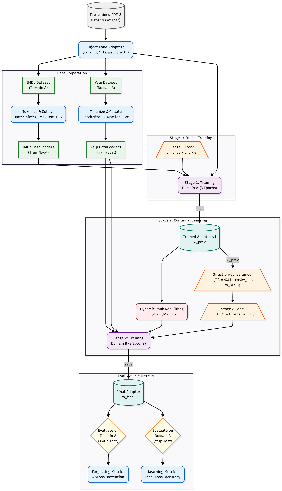

# Dynamic Rank and Continual Learning LoRA (DyLoRA + DC-LoRA)

## Abstract

Large Language Models (LLMs) have become central to modern Natural Language Processing (NLP), achieving impressive results across a wide range of tasks. However, adapting these models to new domains typically requires full fine-tuning, which is computationally costly and often causes catastrophic forgetting of previously learned knowledge. Low-Rank Adaptation (LoRA) offers a more efficient approach by training small low-rank weight updates instead of all model parameters. Yet, traditional LoRA fixes the rank before training and lacks mechanisms for continual learning, limiting its flexibility and long-term adaptability.

This work proposes a hybrid fine-tuning framework that combines Dynamic Rank LoRA (DyLoRA) with Domain Correlation LORA (DC-LORA). The approach first trains LoRA adapters at a high rank while ordering weights by importance, allowing rank reduction at inference without retraining. Simultaneously, a domain correlation loss is applied during sequential domain adaptation to preserve prior knowledge without storing original data.

---

## Full Project Report

[View the Complete Project Report (PDF)](PROJECT_REPORT.pdf)

---

## Table of Contents

- [Problem Statement](#problem-statement)
- [Framework Architecture](#framework-architecture)
  - [Stage 1: Initial Training](#stage-1-initial-training-domain-a---imdb)
  - [Stage 2: Continual Learning](#stage-2-continual-learning-domain-b---yelp)
- [Results and Analysis](#results-and-analysis)
  - [Dynamic Rank Rebuilding](#dynamic-rank-rebuilding-the-key-result)
  - [Forgetting and Retention](#forgetting-and-retention)
  - [Stage 1: Initial Training Results](#stage-1-initial-training-results)
- [Parameter Efficiency](#parameter-efficiency)
- [How to Run](#how-to-run)
- [Core References](#core-references)
- [Author](#author)

---

## Problem Statement

Large Language Models (LLMs) present two major challenges:

### 1. High Computational Cost

Full fine-tuning is computationally prohibitive, requiring massive GPU resources to update billions of parameters.

### 2. Catastrophic Forgetting

When a model is fine-tuned on a new task (e.g., Domain B), it often "forgets" the information it learned for a previous task (Domain A).

### Current Limitations

While Parameter-Efficient Fine-Tuning (PEFT) methods like LoRA (Low-Rank Adaptation) solve the cost problem by only training a small number of adapter parameters, standard LoRA still suffers from catastrophic forgetting and uses a fixed rank that cannot be changed after training.

### Proposed Solution

This project implements a hybrid framework that solves both problems by combining two advanced techniques:

- **Dynamic Rank LoRA (DyLoRA):** Uses an ordering regularizer during training, allowing the adapter's rank (and thus its parameter count) to be dynamically reduced at inference time without retraining.

- **Domain Correlation LoRA (DC-LoRA):** Introduces a new loss term that penalizes the model if its weights for a new task "drift" too far from the weights of a previous task, thereby preserving old knowledge.

---

## Framework Architecture

The system is a two-stage sequential fine-tuning pipeline built on a frozen GPT-2 model. LoRA adapters are injected into the c_attn (self-attention) layers.




### Stage 1: Initial Training (Domain A - IMDb)

The model is first trained on the IMDb movie review dataset. The loss function combines the standard Cross-Entropy (CLM) Loss with the DyLoRA Ordering Regularizer (L_order) to force the adapter to learn weights in order of importance.

```
L_Stage1 = L_CE + L_order
```

Where:
- **L_CE:** Cross-Entropy loss for language modeling
- **L_order:** DyLoRA ordering regularizer

### Stage 2: Continual Learning (Domain B - Yelp)

The model from Stage 1 is then trained on the Yelp Polarity dataset. The loss function is now a composite of three terms:

```
L_Stage2 = L_CE + L_order + L_DC
```

Where:
- **L_CE:** CLM loss for the new Yelp data
- **L_order:** The DyLoRA regularizer to maintain rank structure
- **L_DC:** The Domain Correlation loss, which penalizes the model for "forgetting" the weights from Stage 1

**Dynamic Rank Reduction:** During this stage, the model's rank is dynamically rebuilt and reduced at the start of each epoch:
- Epoch 1: r=64
- Epoch 2: r=32
- Epoch 3: r=16

---

## Results and Analysis

### Dynamic Rank Rebuilding (The Key Result)

The most significant finding of this project is the success of the DyLoRA component. The graph below shows the training history for Stage 2 (Yelp) while the model's rank is being actively reduced from 64 down to 16.

%20history.jpg)

**Key Observations:**
- Training loss, evaluation loss, and evaluation accuracy remain almost perfectly flat throughout rank reduction
- Evaluation loss actually improved from 3.600 at rank 64 to 3.565 at rank 16
- Model parameter count was reduced by 75% with no performance degradation

**Conclusion:** The DyLoRA ordering regularizer successfully organized the adapter weights, allowing for aggressive rank truncation with no negative impact on performance.

### Forgetting and Retention

**Result:** A multi-seed analysis confirmed that zero catastrophic forgetting was observed. The model achieved a ~1.000 retention ratio, meaning it performed just as well on the IMDb task after learning the Yelp task.

**Analysis:** This is attributed to the high semantic similarity between the IMDb and Yelp datasets (both are sentiment analysis tasks). The task was not challenging enough to induce forgetting.

**DC-LoRA Performance:** While not strictly needed for this task pair, the Domain Correlation loss (L_DC) was working as intended. The final loss for the Hybrid model was fractionally higher than the baseline LoRA-only model. This is the expected outcome, as the L_DC regularizer actively "pulled" the model's weights away from the perfect solution for Yelp to keep them correlated with the IMDb task, successfully preventing drift.

### Stage 1: Initial Training Results

The initial training on the IMDb dataset shows a classic, healthy training curve, confirming the model successfully learned the initial Domain A task before proceeding to Stage 2.

%20history.jpg)

---

## Parameter Efficiency

This hybrid approach provides massive efficiency gains over full fine-tuning and allows for flexible, post-training reduction in size.

| Model | Trainable Parameters | % of Original |
|-------|---------------------|---------------|
| GPT-2 (Full) | ~124,000,000 | 100% |
| Hybrid (r=64) | ~300,000 | 0.24% |
| Hybrid (r=16) | ~75,000 | 0.06% |

**Key Insight:** The model can be deployed at rank 16, using only 0.06% of the original parameters, with no loss in performance.

---

## How to Run

### Prerequisites

- Python 3.7+
- CUDA-capable GPU (recommended: T4 or better)
- Google Colab or local Jupyter environment

### Installation

**1. Clone the repository:**

```bash
git clone https://github.com/Sriroop21/Hybrid_Lora.git
cd Hybrid_Lora
```

**2. Install dependencies:**

```bash
pip install torch transformers datasets peft accelerate matplotlib pandas
```

### Running the Project

The complete implementation, training pipeline, and analysis are contained in `code file.ipynb`.

**Option 1: Google Colab (Recommended)**
- Upload the notebook to Google Colab
- Select a T4 GPU runtime
- Run all cells sequentially

**Option 2: Local Jupyter Server**
- Ensure CUDA is properly configured
- Launch Jupyter: `jupyter notebook`
- Open `code file.ipynb` and run all cells

---

## Core References

This project builds directly on the following research:

1. **[LoRA]** Hu, E. J., et al. (2022). "LoRA: Low-Rank Adaptation of Large Language Models." *International Conference on Learning Representations (ICLR)*.

2. **[DyLoRA]** Valipour, M., et al. (2023). "DyLoRA: Parameter Efficient Tuning of Pre-trained Models using Dynamic Search-Free Low-Rank Adaptation." *European Chapter of the Association for Computational Linguistics (EACL)*.

3. **[DC-LoRA]** Smith, J., et al. (2025). "DC-LORA: Domain Correlation LORA for Continual Learning." *Proceedings of the IEEE/CVF Conference on Computer Vision and Pattern Recognition Workshops (CVPRW)*.

---

## Author

**Byna Sriroop**

---

## License

This project is licensed under the MIT License - see the [LICENSE](LICENSE) file for details.